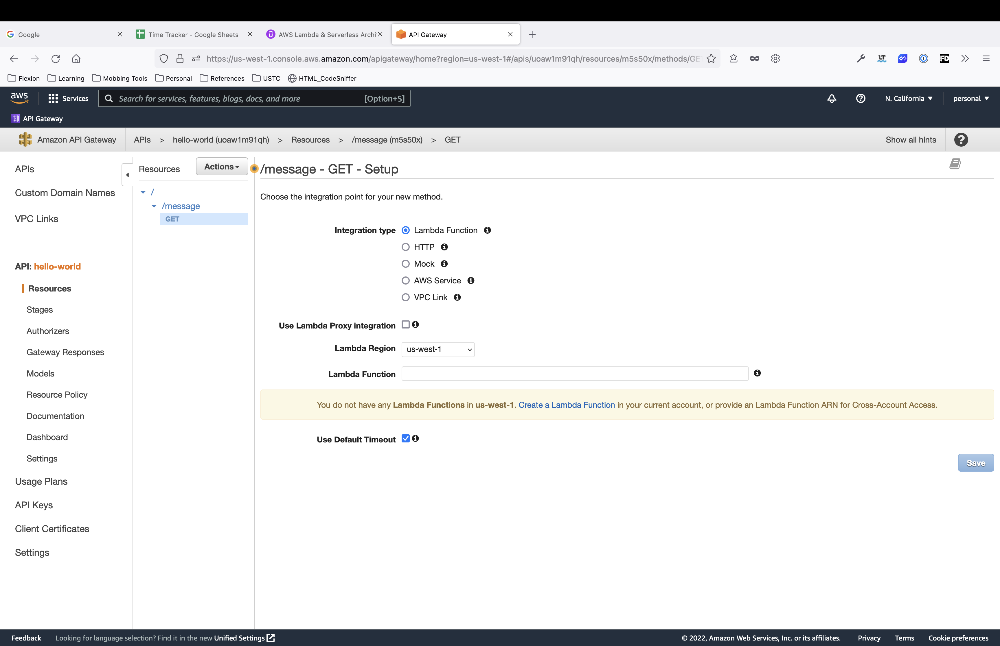

# AWS Lambda & Serverless Architecture Bootcamp

[Udemy Course](https://www.udemy.com/course/aws-lambda-serverless-architecture/learn/lecture/12903128#overview)

## Table of Contents

- [AWS Lambda & Serverless Architecture Bootcamp](#aws-lambda--serverless-architecture-bootcamp)
  - [Table of Contents](#table-of-contents)
  - [Section 1: Getting Started With Serverless Computing on AWS](#section-1-getting-started-with-serverless-computing-on-aws)
    - [What is Serverless? (A 30,000 ft. View)](#what-is-serverless-a-30000-ft-view)
    - [How Serverless Works?](#how-serverless-works)
    - [How to Create 'Hello World' API with Serverless](#how-to-create-hello-world-api-with-serverless)
    - [How to Create Your First Lambda Function](#how-to-create-your-first-lambda-function)
    - [How to integrate AWS Lambda function with API Gateway](#how-to-integrate-aws-lambda-function-with-api-gateway)
    - [Serverless Architecture - Key Features, Benefits and Challenges](#serverless-architecture---key-features-benefits-and-challenges)
      - [Pros](#pros)
      - [Challenge](#challenge)
    - [Major Players in Serverless Space and Why AWS](#major-players-in-serverless-space-and-why-aws)
      - [Why AWS?](#why-aws)
    - [Overview of Core Serverless Services in AWS](#overview-of-core-serverless-services-in-aws)
    - [Overview of Additional Serverless Services in AWS](#overview-of-additional-serverless-services-in-aws)
    - [Use Cases of Serverless Architecture](#use-cases-of-serverless-architecture)
  - [Overview of Frameworks and CI/CD Tools for Serverless](#overview-of-frameworks-and-cicd-tools-for-serverless)
  - [Section 2: Serverless Foundation - AWS Lambda](#section-2-serverless-foundation---aws-lambda)
    - [Quick Overview of AWS Lambda](#quick-overview-of-aws-lambda)
    - [Lambda Permissions Model](#lambda-permissions-model)
    - [Lambda Handler Syntax in Node.js 6.10 and Node.js 8.10](#lambda-handler-syntax-in-nodejs-610-and-nodejs-810)
    - [Event Object, Invocation Types, Event Sources](#event-object-invocation-types-event-sources)

## Section 1: Getting Started With Serverless Computing on AWS

### What is Serverless? (A 30,000 ft. View)

- Serverless computing is the new trend in cloud computing that attempts to solve the challenges of applications that need to be fast, responsive, and scalable with almost no downtime.
- Serverless computing will help you build the next generation of systems that can handle demanding workloads and scale indefinitely without having to provision or manage any servers.

Traditional architecture:

- you got to create and setup servers,
- install operating systems,
- install and setup databases,
- manage software patches and hardware updates,
- manage capacity and scaling, ManageHigh-availability through load-balancing and so on

This server infrastructure and the computing power has its own costs, which are often substantial.

Serverless architecture:

- Serverless Architecture, all these mundane tasks of managing the underlying infrastructure are abstracted away from us.

Serverless Computing still uses servers, but you no longer have to worry about managing them or worry about the uptime or availability or anything that has to do with the infrastructure part.

Advantages of Serverless vs. Traditional

- You kind of get to be more productive
- You can completely focus on writing your code without having to worry about the underlying support system
- So you simply upload your code to the cloud provider and it can be run on-demand as and when needed.

[back](#table-of-contents)

### How Serverless Works?

With Serverless, you write your code in the form of functions, just like you’d write a function in any programming language. And these functions then run in the cloud. So, you segregate your application logic in to small independent functions or microservices and upload them to the cloud provider.

These functions are stateless and can be invoked in response to different events. These events could be file uploads, database updates, in-app activity, API calls, website clicks, or sensor outputs just like those from IoT devices and so on.

These serverless functions often run in Docker-like containers and hence several instances of these functions can be run concurrently, like in a Docker swarm for example, thus making them highly highly scalable.

Serverless means “Event-driven Computing” using “Small independent stateless functions” running inside “containers in the cloud”.

So, you have your code running on the cloud platform, AWS in our case.

Whenever the triggering event occurs, the cloud platform spins up a container or initializes a container, loads the function in it and executes the function. And this happens almost instantaneously, thereby allowing us to build applications that respond quickly to new information and thus enhance user experience. Once the function completes execution, it optionally returns a response back to the caller, and then finally exits or shuts down.

AWS Lambda and API Gateway are the two of the core services of the AWS serverless platform

[back](#table-of-contents)

### How to Create 'Hello World' API with Serverless

[AWS Management Console](https://us-west-1.console.aws.amazon.com/console/home?nc2=h_ct&region=us-west-1&src=header-signin#)

**Create an API**

1. Login in to `AWS Management Console`
2. Search for `API Gateway`
3. Choose an API type (Rest API in this case)
4. Click on **Build** button
5. Make sure REST is selected
6. Click on **New API** radio button
7. Name your API
8. Click on **Create API** button

Once completed, this will redirect you to Resources screen


- here we can create Resources and methods for the API

**Create an End Point/Resource manually**

1. Click on **Actions** drop down
2. Click on **Create Resource**
3. Name the resource
4. Click on **Create Resource** button


**Add a method to a resource**

1. Click on **Actions** drop down
2. Click on **Create Method**
3. Select the appropriate method
4. Click on the :heavy_check_mark: button
5. Select your Integration Type
6. Click on **Save** button



This will take you to the **Method Execution** screen


When we make an API call, the incoming request is passed from the Method Request block tothe integration request block where we map or transform the incoming request to the formatthat our backend understands.

In our case there is no backend since we are simply mocking a response using the Mock integration Type.

The response received from the backend is then mapped or transformed in the Integration Response block to match the format that the calling application expects and then the Method response relays the response back to the client.

**Create a Response**

1. Click on **Integration Response** link
2. Click on drop down arrow next to 200 Method response status
3. Click on drop down arrow next to Mapping Templates
4. Click **Add mapping template**
5. Add `application/json` then click on the :heavy_check_mark: button
6. Add your json on the right


**Deployment**

1. Once all is configured, click on the **Actions** drop down
2. Select **Deploy API**
3. Choose **New Stage** from the **Deployment stage** drop down
4. Give your stage a name (ex. Test)
5. Click **Deploy** button


There are two ways to test your API at this point

**Option 1:**

1. Make sure you are on the `Stages` tab
2. Click on `GET` method under `message`
3. Click on **Invoke URL:**


> :warning: WARNING:
>
> Make sure you click on the link for your method and not under test stage itself.
> You will get a `message: "Missing Authentication Token"` because test is the root
> and it does not have a `GET` method.

**Option 2:**

1. Navigate to `GET - Method Execution` screen under Resources tab
2. Click on **TEST** on Client
3. Click on **Test** button at the bottom


[back](#table-of-contents)

### How to Create Your First Lambda Function

1. AWS Management Console click on **Services** upper left corner
2. Click on **Compute**
3. Under **Compute** click on **Lambda**
4. Click on **Create function** button
5. Select **Author from scratch**
6. Name your function
7. Either select your runtime or leave it at the default
8. Click on drop down arrow next to **Change default execution role** and select your option
9. Click on **Create function** button
10. Change index.js code what you need
11. Save your function
12. Configure your test event
13. Click **Save** button
14. In order to test it, make to deploy the function

_index.js_

```javascript
var messages = [
  'Hello World!',
  'Hello Serverless!',
  "It's a great day today!",
  "Yay, I'm learning something new today!",
  'On cloud nine!',
  'Over the moon!',
  'Shooting for the stars!',
  'On top of the World!',
  'World at my feet!',
  'Doing everything I love!',
];

exports.handler = (event, context, callback) => {
  let message = messages[Math.floor(Math.random() * 10)];
  callback(null, message);
};
```


[back](#table-of-contents)

### How to integrate AWS Lambda function with API Gateway

1. Go back to the API Gateway
2. Click on your method
3. Click on **Method Execution**
4. Click on **Integration Request**
5. Select **Lambda Function** from **Integration Type**
6. Select the same region you created your Lambda in
7. Type in the name of your function in Lambda Function text box
8. Click on **Save** button
9. Go back to **Method Execution**
10. Click on **Integration Request**
11. Click on down arrow next to **Mapping Templates**
12. Under **Content-Type** type in `application/json` and then click on :heavy_check_mark: button
13. Click on `application/json` and enter in the below json
14. Click on **Save** button
15. Redeploy the API

```json
{
    "message": $input.body
}
```

> :paperclip: NOTE:
>
> > To see which region you created your Lambda in,
> > click on your Lambda and look in the URL.
> > It will tell you the region.

[back](#table-of-contents)

### Serverless Architecture - Key Features, Benefits and Challenges

#### Pros

- no server management
  - no servers, operating systems, hardware or software to maintain
  - faster innovation, high productivity and faster time to market
  - in most cases serverless applications require little to no administration
- easy and efficient scaling
  - can be scaled automatically or at the most with a few clicks to choose desired capacity
  - no need to create any specialized scalable architecture or designs
  - get a large number of serverless functions running within seconds
  - each function runs for a few hundred milliseconds to a few minutes
  - allocate resources for each if these functions individually
- built-in high availability and fault tolerance
  - no specialized infrastructure
- service integration
  - AWS provides a host of services that readily integrate with each other
  - allow you to perform a lot of stuff very, very easily
    - sending text notifications
    - emails
    - running analytics
    - hosting APIs
    - storing files
    - running automated workflows
    - deploying machine learning models
- no idle capacity
  - pay for only what you use and no more
  - only pay for the time your code runs

#### Challenge

- vendor lock-ins
  - only a handful of cloud providers like Amazon AWS, Microsoft Azure, Google Cloud Platform, IBM Cloud
  - one way to alleviate this challenge is use multi-provider serverless
- public cloud
  - some use cases or industry-specific regulatory requirements may be a deterrent to using public cloud
  - serverless can be run on private clouds
- level of control
  - giving up some degree of control by letting someone else manage the infrastructure for you
  - some situations, you may need more control of hardware resources or OS level resources

[back](#table-of-contents)

### Major Players in Serverless Space and Why AWS

- core component of the AWS Serverless Architecture is the compute service called AWS Lambda


#### Why AWS?

- Besides being the first to enter the serverless space, AWS Lambda has its strength being apart of the huge AWS ecosystem, thereby allowing seamless integration with host of other AWS services

[back](#table-of-contents)

### Overview of Core Serverless Services in AWS

- There are three core services that you can find in almost every serverless application


- These services are the foundation or the backbone of the AWS Serverless platform
- additional web services that you can use in serverless applications depending on your use case

  - S3
  - SNS
  - SQS
  - AWS Step Functions
  - Kinesis
  - Athena

- AWS Lambda
  - lets you run your code without having to create or manage any servers
  - upload code to Lambda and Lambda does the rest for you and ensures that your code runs on highly scalable and highly available infrastructure
  - each piece of codes that you upload to Lambda is called as a Lambda Function and it runs in an independent isolated environment also called as a container
  - only pay for the time your code runs
  - provides fine grained access control letting you decide who can invoke Lambda Functions and which services can be executed by the Lambda Function
  - comes with version management capabilities allowing you to manage your deployments efficiently
- Amazon API Gateway
  - helps you create and publish APIs
  - integrates with AWS Lambda to let you create completely serverless APIs
  - can handle thousands fo concurrent API calls
  - gives you fill control to create your APIs with fine-grained access control and version management capabilities
- DynamoDB
  - highly-scalable high-performance NoSQL serverless database
  - can scale on demand to support virtually unlimited concurrent read/write operations with response times in single-digit milliseconds
  - DynamoDB DAX or DynamoDB Accelerator
    - can further bring down the response times from milliseconds to microseconds
    - DAX is a caching service

[back](#table-of-contents)

### Overview of Additional Serverless Services in AWS

1. Amazon Simple Storage Service or S3

- very simple and intuitive web service
- can store and access your data from anywhere in the web with fine-grained access control
- lets you build static websites that can interact with your Lambda code (basically use S3 as a front end of your serverless application)

2. AWS provides two services that you can use here for inter-process messaging

   1. SNS or Simple Notification Service
      - a fully -managed notification service that allows you to publish notifications and any services or software components that subscribe to these notifications will receive messages
   2. SQS or Simple Queue Service
      - very simple and intuitive messaging service that you can send and receive message at virtually any volume
      - allows multiple publishers and consumers to read and write messages from the same queue
      - can retain this message up to a certain pre-defined time period or until you explicitly delete the message

3. AWS Step Functions

- there could be several Lambda functions working together and your application might need a way to orchestrate these functions
- i.e. execute them in a certain order that might be known at runtime
- lets you build visual workflows to coordinate different Lambda functions to work together and form a larger serverless application

4. Analytics

   1. Amazon Kinesis

   - a platform for streaming data applications
   - work with or analyze streaming data in real time

   2. Amazon Athena

   - interactive query service that you can use to query your data stored in Amazon S3 using standard SQL syntax

5. Debugging Tools

   1. AWS X-Ray
   2. AWS CloudWatch

6. AWS Cognito

- serverless user authentication and management service
- supports authentication of users for your application via username/passwords and also via Federated Identity or Open ID providers like Facebook, Google, Twitter, Amazon and so on
  - also you can have your own custom Open ID provider

7. AWS SDKs

AWS Lambda supports several programming languages like Node.js or JavaScript, Python, Java, C#, .NET Code and Google Go

[back](#table-of-contents)

### Use Cases of Serverless Architecture

Serverless architecture allows us to build just about any type of application or back-end service that you can think of

:computer: :iphone: :earth_americas:

1. Application backends

- build backends for Web, Mobile or IoT applications
- typically make use of AWS Lambda, API Gateway, DynamoDB, S3 or even Step Functions as needed
- frontends act as event sources to trigger our lambda code
- each incoming request from the end user is typically received by one of the endpoints exposed by teh API Gateway
- API Gateway then triggers a call to Lambda function and Lambda function then coordinates with different web services like S3 or DynamoDB to generate a response and then return that response back to the end user
- Amazon S3 can also be used to create the app front-end in this case
- these frontends are wired to the serverless backends by means of APIs that we create using the API Gateway

2. Real-time or Streaming Data Processing

- Amazon Kinesis ro Kinesis Firehose with Lambda, DynamoDB and S3 to create your real-time data processing systems
- Amazon Kinesis is a service that lets you collect, process and analyze real-time streaming data from multiple sources, at absolutely any scale
  - you can literally process terabytes of data every hour, coming in from thousands and thousands of sources simultaneously
  - Kinesis also provides Data Analytics services that can be used to build Real-time Analytics applications

[back](#table-of-contents)

## Overview of Frameworks and CI/CD Tools for Serverless

There are two frameworks that help you work with your serverless applications efficiently

1. AWS SAM or Serverless Application Model

- a tool provided by Amazon
- lightweight version of AWS CloudFormation
  - CloudFormation is a service that allows you to automate creating and deploying various AWS services quickly using a text-based template file
- AWS SAM uses similar template file but with a simplified syntax
- CloudFormation internally converts this SAM template into the standard CloudFormation syntax to create and deploy our serverless resources

2. Serverless Framework

- a popular third party tool provided by Serverless Inc.
- open source tool and works on similar lines as the AWS SAM
- template syntax is slightly different but equally easy
- also has an open source plug-in system which allows any one to extend its functionality

3. AWS CodeCommit

- version control or source control system that provides a GIT based repository and you can use it as your codebase
- allows you to maintain private repositories of your application code

4. AWS CodeBuild

- allows you to build serverless code and create or update AWS resources automatically via CloudFormation
- allows you to deploy your serverless application as well

5. AWS CodePipeline

- is a service that allows you to define the delivery or deployment process for our serverless applications

[back](#table-of-contents)

## Section 2: Serverless Foundation - AWS Lambda

### Quick Overview of AWS Lambda

Serverless computing execution model in which the cloud provider dynamically manages the allocation of infrastructure resources, so we don't have to worry about managing server or any of the infrastructure.

AWS Lambda is an event-driven serverless computing platform or a compute service provider by AWS. The code we run on AWS Lambda is called a Lambda function.

You can write the Lambda functions right inside the Lambda console or write them locally on our computer and upload them to Lambda.

Once the code is deployed to Lambda, it is ready to run. It runs whenever it is triggered by a preconfigured event source. They can be triggered by numerous event sources like API Gateway calls, S3 file uploads, changes to DynamoDB table data, CloudWatch events, SNS Notifications, third party APIs, IoT devices and so on. The Lambda functions run in containerized environments which spring into action only when triggered by an event-source.

[back](#table-of-contents)

### Lambda Permissions Model

- AWS uses a decoupled permissions model
- the service or event that triggers the Lambda function only requires the necessary permissions to invoke the Lambda function
- when you add an event trigger to your Lambda function, it is automatically assigned an appropriate IAM policy to invoke this Lambda function
  - this role is called a Lambda invocation policy or Function policy
- for Lambda functions, you also have access to a list of services
  - these permissions are called a Lambda execution role

[back](#table-of-contents)

### Lambda Handler Syntax in Node.js 6.10 and Node.js 8.10

_nodejs 6.10_

```node
exports.handler = (event, context, callback) => {
  /// code to execute goes here

  callback(null, result);
};
```

_nodejs 8.10_

```node
exports.handler = async (event, context) => {
  const data = event.data;

  let newImage = await resizeImage();

  return newImage;
};

const resizeImage = (data) =>
  new Promise((resolve, reject) => {
    // code goes here

    if (error) {
      reject(error);
    } else {
      resolve(result);
    }
  });
```

Regardless of which version you use, there are two important arguments into the event handler: event & context

[back](#table-of-contents)

### Event Object, Invocation Types, Event Sources

- holds the input data or input parameters that we want the Lambda function to act on.
- the structure of the event object depends on the event source
- there are different event triggers that can invoke the Lambda function
- supports two invocation types and depends on the event source:
  - synchronous
  - asynchronous
  - Example:
    - S3 event is always asynchronous and API Gateway or Cognito event is always synchronous and we have not control over this
  - However, in cases where we invoke the Lambda function through our own application using the invoke method of the AWS SDK, we can choose the invocation type
- two types of event sources:
  - push based events
    - push the event data to Lambda in order to invoke the function
    - S3 or API Gateway events
  - pull events or poll-based events
    - Lambda polls the event stream to look for event data
    - DynamoDB stream event, a Kinesis stream event or an Amazon SQS queue event

If we invoke the Lambda function from our code using Amazon SDK, we can have our own custom event structure

[back](#table-of-contents)
